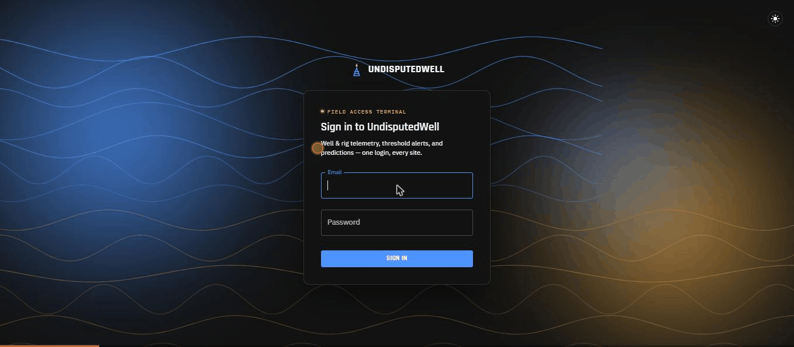
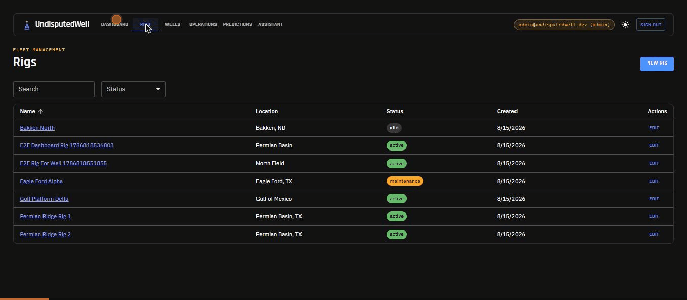

# UndisputedWell

See [PLAN.md](./PLAN.md) for the architecture decision, milestones, and test-coverage plan.

## Screenshots

Signing in, and a walkthrough of the fleet dashboard, rigs/wells, operations, predictions, and
the AI assistant — all in dark mode (there's a light theme too; toggle it top-right on any page).

<p>
  
  
</p>

## Run everything

```
docker compose up --build
```

- App: http://localhost:8080
- API health check: http://localhost:8080/api/health

**Production note:** the session cookie is `Secure` (see PLAN.md auth decision), so real
browsers will only send it back over HTTPS. This local Compose setup terminates plain HTTP on
Nginx for simplicity — production deployments must put a TLS-terminating proxy/load balancer
in front of it. (`SESSION_COOKIE_SECURE=false` can be set for a non-HTTPS local override if
ever needed, but the default is intentionally the secure behavior.) See "Deployment" below for
the full production checklist.

## Local development

Backend:
```
cd backend
python -m venv .venv
.venv/Scripts/activate   # or .venv/bin/activate on macOS/Linux/MSYS
pip install -r requirements.txt
uvicorn app.main:app --reload
```

Frontend:
```
cd frontend
npm install
npm run dev
```

## Tests

```
cd backend && pytest --cov=app --cov-report=term-missing
cd frontend && npm run test:coverage
cd frontend && npm run test:e2e   # requires the stack running via docker compose
```

### Seed a user

There is no public signup endpoint — everything is behind a login wall (see PLAN.md) — so
provision the first user manually. The e2e auth suite expects this exact admin account to exist:

```
docker compose exec backend python -m scripts.seed_admin admin@undisputedwell.dev "correct horse battery staple"
```

The M2/M3 e2e suites additionally expect a viewer account, provisioned with the more general `seed_user` script:

```
docker compose exec backend python -m scripts.seed_user viewer@undisputedwell.dev "correct horse battery staple" viewer
```

## CI

`.github/workflows/ci.yml` runs on every push/PR: Jest (with its Istanbul coverage gate) and
pytest (with its own coverage gate) run first as fast, self-contained checks — neither needs
Docker, pytest runs against an in-memory SQLite DB — then a third job builds and starts the
real Docker Compose stack (`docker compose up -d --build --wait`, which doubles as the
"does the stack actually come up healthy" smoke test) and runs the full Playwright e2e suite
against it headlessly.

## Deployment

This repo's Compose setup is dev-oriented but deploy-*shaped*: same architecture, same images,
same health checks a production deployment would use — it's not a from-scratch rewrite to go
live, but it isn't a one-command production deploy either. Before actually deploying:

- **Secrets**: copy `.env.example` to `.env` and set a real `POSTGRES_PASSWORD` — the
  checked-in default is dev-only. (There's no session/CSRF secret key to manage: sessions and
  CSRF tokens are opaque random values checked against the database, not signed tokens — see
  `core/security.py`.)
- **TLS**: put a TLS-terminating reverse proxy or load balancer in front of the `web` service —
  this Compose setup terminates plain HTTP on Nginx for local simplicity, and the session
  cookie's `Secure` attribute (on by default; see above) means browsers silently won't send it
  back over plain HTTP.
- **Database persistence/backups**: the `postgres_data` volume persists across container
  restarts, but nothing here backs it up. Point it at a managed Postgres instance, or add a
  real backup job, before trusting it with real data.
- **Migrations**: `docker compose exec backend alembic upgrade head` is a manual step here (see
  every milestone's verification in PLAN.md) — a real deploy pipeline should run it
  automatically before/during rollout, not by hand.
- **Restart policy / resource limits**: all three services already have `restart: unless-stopped`
  and health checks; add CPU/memory limits appropriate to the host before running at scale.
- **Bundle size**: the frontend's production JS bundle is ~970 kB unminified-equivalent /
  ~300 kB gzipped as a single chunk (Vite warns about this in `npm run build`). Fine for this
  project's scope; a larger app should code-split before shipping.
